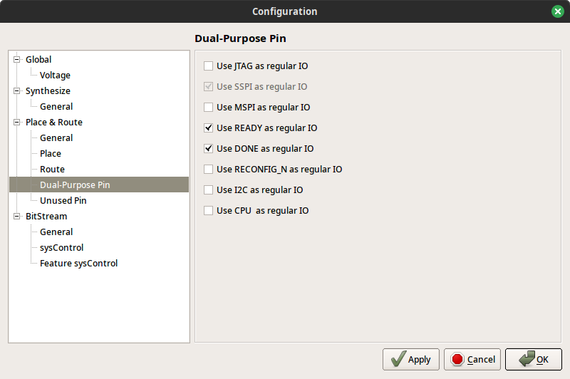

# 01_thruwire-onboard

Simple switch <-> LED connection using board only.

- Connecting switch S1 status to LED "DONE"
- Connecting inverted switch S2 status to LED "READY"

## Requirements

Tang Primer 25K board
GOWIN FPGA Designer 1.9.9 Beta-4 or newer IDE

## Configuration

### Dual-Purpose Pin

Menu Project -> Configuration -> Place & Route -> Dual-Purpose Pin
Check "Use READY as regular IO" and "Use DONE as regular IO"



## verilator

```bash
cd src
make
```

## Troubleshooting

Problem:

```text
ERROR  (PR2028) : The constrained location is useless in current package
ERROR  (PR2017) : 'o_led_ready' cannot be placed according to constraint, for the location is a dedicated pin (READY)
```

Solution:

Make sure you performed PnR Dual-Purpose Pin configuration.
