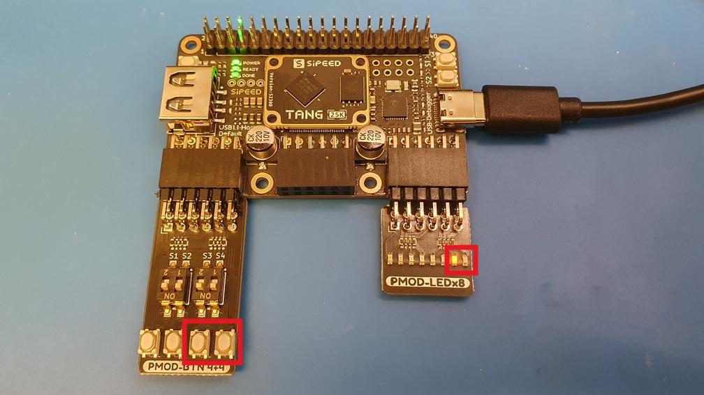

# 02_thruwire-pmod

Simple switch <-> LED connection using PMOD boards.

- Connecting button 1 status to LED1[0]
- Connecting inverted button 2 status to LED1[1]

## Requirements

Tang Primer 25K board
GOWIN FPGA Designer 1.9.9 Beta-4 or newer IDE

PMOD-LEDx8
PMOD-BTN4x4
