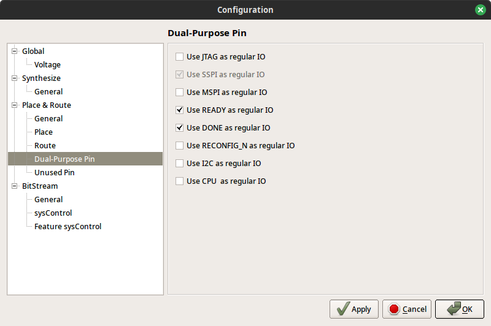

# 01_AND-gate-onboard

Creates AND gate with 2 inputs:

- gate inputs are connected to switches S1 and S2
- gate output is connected to LED "DONE"

## Requirements

Tang Primer 25K board
GOWIN FPGA Designer 1.9.9 Beta-4 or newer IDE

## Configuration

### Dual-Purpose Pin

Menu Project -> Configuration -> Place & Route -> Dual-Purpose Pin
Check "Use READY as regular IO" and "Use DONE as regular IO"

